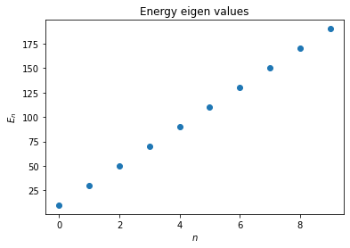
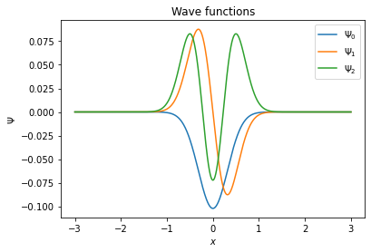

# Heisenberg
I am starting this repo as a first stage towards a Python library that can solve the Schrodinger equation in any dimensions under arbitrary potentials and boundary conditions using FInite DIfference or Spectral Methods.


## The 1D Harmonic Oscillator as an example           

The Schrodinger equation with the constants omitted is:

$$ \frac{d^2 \Psi}{dx^2} + x^2 \Psi = E \Psi $$

We will solve the problem on a discrete grid $x = [x_1,...,x_i,...,x_N]$ on the interval $[-L,L]$. The finite difference approximation of the second derivative is:

$$ \frac{d^2 \Psi}{dx^2} \left( x_i \right) = \frac{\Psi_{i-1} - 2 \Psi_i + \Psi_{i+1}}{h^2} + \mathcal{O} .$$

The differntial equation can now be converted into a matrix eigen value problem as finding the eigen values of the matrix $H =D2 + V$. $D2$ is created by rolling $[-2, 1, 0,...,0, 1]$ across the rows and $V$ is the diagonal matrix created from the potential evaluated on the grid.

A quick Python implimentation would look like:

```python
import numpy as np
import matplotlib.pyplot as plt
from numpy import linalg as LA

N = 2**10
x = np.linspace(-3,3,N)
h = 6/N

row = np.array([-2,1] + [0 for i in range(N-3)] + [1])
D2 = [row]

for i in range(1,N):
    row = np.roll(row,1)
    D2.append(row)

D2 = np.array(D2)

# Incomporating the boundary conditions
D2[0,N-1] = 0
D2[N-1,0] = 0

V = 100*x**2

H = -D2/(h**2) + np.diag(V)

E, v = LA.eig(H)

Psi = {}

sorted_indices = np.argsort(E)
E = [E[i] for i in sorted_indices]
Psi = [v[:,i] for i in sorted_indices]
```

Now we have the $N$ energy eigen functions and eigen vectors. A quick plot will reveal the solutions are reasonable.

```python
plt.scatter(list(range(10)),E[:10])
plt.xlabel('$n$')
plt.ylabel('$E_n$')
plt.title('Energy eigen values')
plt.show()
```
<p align="center">
  
</p>

```python
for i in range(3):
    plt.plot(x, Psi[i], label=str(i))
plt.legend(['$\Psi_'+str(i)+'$' for i in range(5)])
plt.xlabel('$x$')
plt.ylabel('$\Psi$')
plt.title('Wave functions')
```

<p align="center">
  
</p>

## Extension to higher dimensions

For example, the method can be easily extended to higher dimensions through tensor product operation. In 3D, the $\nabla^2$ can be approximated using the same $D2$ matrix as

$$ D2 \otimes I_{N \times N} \otimes I_{N \times N} + I_{N \times N} \otimes D2 \otimes I_{N \times N} + I_{N \times N} \otimes I_{N \times N} \otimes D2 $$
